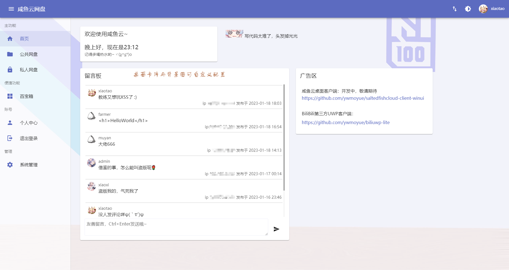
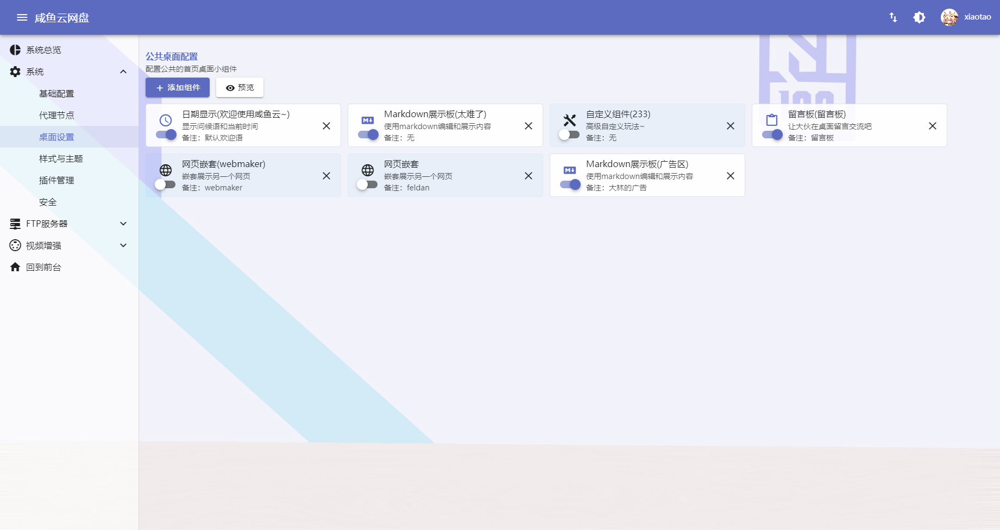
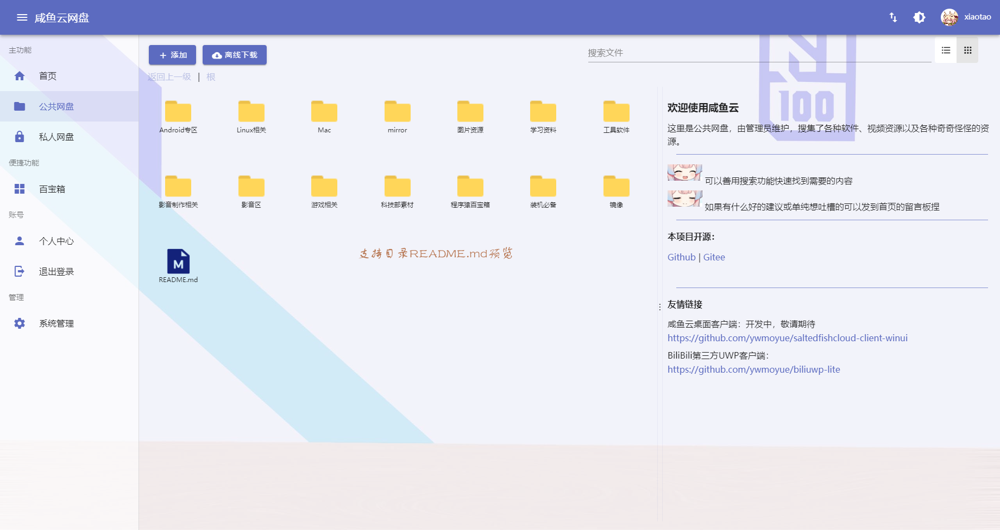
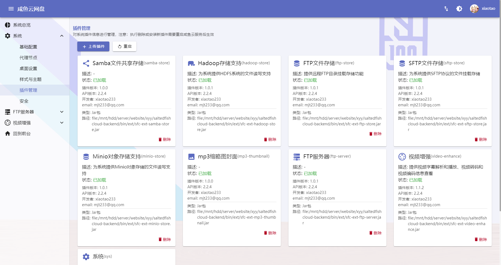

# 咸鱼云网盘-前端


## 简介

咸鱼云网盘目前是一个用于共享文件和实现私人网盘基本功能的系统，同时具有公共网盘与私人网盘，公共资源站与私有存储云两不误。

> 该项目仅为前端项目，后端项目请移步[Github](https://github.com/mjt233/saltedfishcloud-backend) 或 [Gitee](https://gitee.com/xiaotao233/saltedfishcloud-backend)

## 快速开始  

> 注意：Node.js版本需要20+，本项目开发时使用20.18.0(LTS)

1. 构建项目  
```bash
# 安装依赖（国内可使用cnpm代替npm）
npm install

# 构建生产版本（构建完毕后，项目静态文件在/dist，将里面的文件部署到web服务器即可）
npm run build
```

2. 部署项目，复制`/dist`目录下的文件到Web服务器
   1. 使用Docker部署（待完善）
      1. 拉取镜像
        ```shell
        $ docker pull farmerchillax/sfc-web
        ```
      2. 运行容器
        ```shell
        $ docker run -d -p 80:80 -e API_ADDR=后端API地址 sfc-web
        ```
      3. 环境变量  

        |名称|默认值|描述|
        |----|----|----|
        |API_ADDR|http://127.0.0.1:8087|后端API地址|
        |MAX_BODY_SIZE|8192m|文件上传大小限制|
        |SERVER_NAME|_|绑定的HTTP Host|
        |HTTP_PORT|80|Nginx HTTP服务端口|

      4. 如果你想自己构建
        ```shell
        $ docker build -t <your docker image name> .
        ```
   2. 使用Nginx部署  
    ```nginx
    server{

        # 不开启SSL则使用下面两条被注释的配置
        # listen 80;
        # listen [::]:80;
        listen 443 ssl;
        listen [::]:443 ssl;

        # 主机名
        server_name 访问的主机名;
        client_max_body_size 8192m;

        # SSL配置（可选）
        ssl_certificate SSL证书crt路径;
        ssl_certificate_key SSL证书key路径;

        # 项目编译后的资源根目录
        root dist文件夹;
        index index.html;

        # gzip配置 - 针对大于32k的js和css文件启用gzip
        gzip on;
        gzip_min_length 32k;
        # gzip配置 - 压缩等级，越小CPU开销越低，文件越大。标准推荐4-6。
        gzip_comp_level 3;
        gzip_types application/javascript text/css;
        gzip_vary on;
        gzip_disable "MSIE [1-6]\.";

        # 使用反向代理后端时可选配置
        location ~ (^/api|^/download) {
            # 后端API地址
            proxy_pass http://127.0.0.1:8087;
            proxy_buffering off;
            proxy_request_buffering off;
            proxy_set_header  Host $http_host;
            proxy_set_header  X-Real-IP  $remote_addr;
            proxy_set_header  X-Forwarded-For $proxy_add_x_forwarded_for;
            proxy_set_header  X-Forwarded-Proto $scheme;
            proxy_http_version 1.1;
            proxy_set_header Upgrade $http_upgrade;
            proxy_set_header Connection $connection_upgrade;
            index index.html index.htm;
        }

        # SSL自动转跳（可选）
        error_page 497 https://$server_name$request_uri;
    }
    ```
   3. 与后端集成打包  
      1. 将编译后产生的`dist`下的内容复制到后端项目的`/src/main/resources/webapp/`下  
      2. 依照[后端项目](https://gitee.com/xiaotao233/saltedfishcloud-backend)打包和运行步骤执行即可


## 部分前端界面展示

- 支持自定义配置的首页
  
  
- 目录浏览支持README.md渲染和在线编辑
  
- 管理员后台-简单的插件系统
  