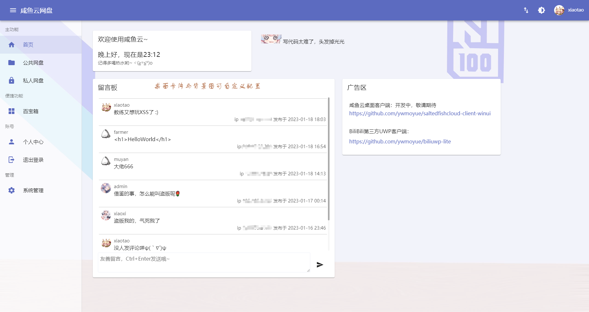

# 咸鱼云网盘-前端


## 简介

咸鱼云网盘目前是一个用于共享文件和实现私人网盘基本功能的系统，同时具有公共网盘与私人网盘，公共资源站与私有存储云两不误。

### 功能介绍

#### 基础功能

- 公共网盘与私人网盘两个存储域
- 文件搜索
- 文件收集
- 文件/目录分享
- 外部存储挂载
- 在线解压缩
- 默认按文件哈希散列统一组织文件，支持文件秒传
- 自定义配置桌面组件
- 文本文件在线编辑，markdown编辑实时预览
- 视频在线播放

#### 其他技术特性  

- 具有插件系统
- 兼容低版本到高版本的升级，自动更新数据库
- 构建与部署简单，具有统一的属性参数配置系统，大部分参数都能在运行期间通过管理员界面进行动态配置。
- 支持docker部署（文档待补充）
- 支持在线重启
- 系统启动失败会进入紧急模式，可通过`/api/error`查看启动失败原因，通过`/api/admin/sys/restart`重启


#### 拓展功能（插件支持）

- 支持存储集群
- 外部存储目录挂载 - MinIO,HDFS,Samba,SFTP协议的外部存储读写支持
- 自定义视频转码、字幕提取
- 作为FTP服务端提供网盘文件访问
## 杂杂念

该项目是我大二时从无Java基础一边学习一边开发一边重构和维护的项目，难免会有明显bug或明显的设计缺陷。

欢迎各路大佬提出批评、建议和issue。也欢迎感兴趣的大佬贡献代码。

## 提示 
- 该项目仅为前端，不带后端，后端项目请移步[这里](https://gitee.com/xiaotao233/saltedfishcloud-backend)


## 快速开始  

1. 构建项目  
```bash
# 安装依赖（国内可使用cnpm代替npm）
npm install

# 构建生产版本（构建完毕后，项目静态文件在/dist，将里面的文件部署到web服务器即可）
npm run build
```

2. 部署项目，复制`/dist`目录下的文件到Web服务器
   1. 使用Docker部署（待完善）
      1. 拉取镜像
        ```shell
        $ docker pull farmerchillax/sfc-web
        ```
      2. 运行容器
        ```shell
        $ docker run -d -p 80:80 -e API_ADDR=后端API地址 sfc-web
        ```
      3. 环境变量  

        |名称|默认值|描述|
        |----|----|----|
        |API_ADDR|http://127.0.0.1:8087|后端API地址|
        |MAX_BODY_SIZE|8192m|文件上传大小限制|
        |SERVER_NAME|_|绑定的HTTP Host|
        |HTTP_PORT|80|Nginx HTTP服务端口|

      4. 如果你想自己构建
        ```shell
        $ docker build -t <your docker image name> .
        ```
   2. 使用Nginx部署  
    ```nginx
    server{

        # 不开启SSL则使用下面两条被注释的配置
        # listen 80;
        # listen [::]:80;
        listen 443 ssl;
        listen [::]:443 ssl;

        # 主机名
        server_name 访问的主机名;
        client_max_body_size 8192m;

        # SSL配置（可选）
        ssl_certificate SSL证书crt路径;
        ssl_certificate_key SSL证书key路径;

        # 项目编译后的资源根目录
        root dist文件夹;
        index index.html;

        # 使用反向代理后端时可选配置
        location ~ (^/api|^/download) {
            # 后端API地址
            proxy_pass http://127.0.0.1:8087;
            proxy_buffering off;
            proxy_set_header X-Real-IP $remote_addr;
            proxy_set_header X-Forwarded-For $proxy_add_x_forwarded_for;
            index index.html index.htm;
        }

        # SSL自动转跳（可选）
        error_page 497 https://$server_name$request_uri;
    }
    ```
   3. 与后端集成打包  
      1. 将编译后产生的`dist`下的内容复制到后端项目的`/src/main/resources/webapp/`下  
      2. 依照[后端项目](https://gitee.com/xiaotao233/saltedfishcloud-backend)打包和运行步骤执行即可


## 部分前端界面展示

- 支持自定义配置的首页
  
  
- 目录浏览支持README.md渲染和在线编辑
  
- 管理员后台-简单的插件系统
  