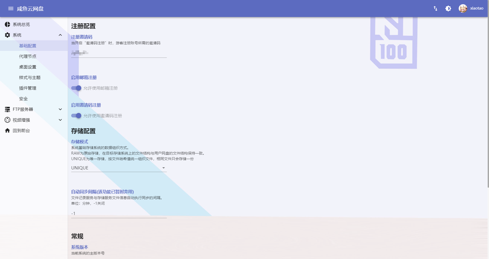

# 咸鱼云网盘-前端


## 简介
咸鱼云网盘目前是一个用于共享文件和实现私人网盘基本功能的系统，目前仍处于初期开发阶段，许多功能和文档尚未完善。  
该项目最初由Vue2 + MDUI开发，见`vue2-1.8.6.0-RELEASE`分支，现使用Vue3+Vite+Vuetify进行了重写，部分功能仍未100%完成重写（如管理员界面）。

## 杂杂念
该项目目前仅由我个人（学生）进行维护，是我从无基础（经验）一边学习一边开发一边重构和维护的项目，难免会有明显bug或明显的设计缺陷，对项目有任何疑问或建议，欢迎各路大佬评论或提出issue。

如果你对我这个玩具项目感兴趣，想参与项目开发，可以直接fork该项目，发起Pull Request，审核和测试通过后将合并你的代码。

如果长时间未得到我的回复，可能是我刚好比较忙或忘了回复，可以试着给我发邮件。

## 提示 
- 该项目仅为前端，不带后端，后端项目请移步[这里](https://gitee.com/xiaotao233/saltedfishcloud-backend)


## 快速开始  

1. 构建项目  
```bash
# 安装依赖（国内可使用cnpm代替npm）
npm install

# 构建生产版本（构建完毕后，项目静态文件在/dist，将里面的文件部署到web服务器即可）
# 构建视频播放器插件（插件开发的demo，验证可行性用的，后面会进一步完善这个流程），最后构建打包总项目
npm run build-ext-video-player
npm run build
```

2. 部署项目，复制`/dist`目录下的文件到Web服务器
   1. 使用Docker部署（待完善）
      1. 构建docker镜像
        ```shell
        docker build -t sfc-web .
        ```
      2. 创建容器
        ```shell
        docker run -d -p 80:80 -e API_ADDR=后端API地址 sfc-web
        ```
      3. 环境变量  

        |名称|默认值|描述|
        |-|-|-|
        |API_ADDR|http://127.0.0.1:8087|后端API地址|
        |MAX_BODY_SIZE|8192m|文件上传大小限制|
        |SERVER_NAME|_|绑定的HTTP Host|
        |HTTP_PORT|80|Nginx HTTP服务端口|
   2. 使用Nginx部署  
    ```nginx
    server{

        # 不开启SSL则使用下面两条被注释的配置
        # listen 80;
        # listen [::]:80;
        listen 443 ssl;
        listen [::]:443 ssl;

        # 主机名
        server_name 访问的主机名;
        client_max_body_size 8192m;

        # SSL配置（可选）
        ssl_certificate SSL证书crt路径;
        ssl_certificate_key SSL证书key路径;

        # 项目编译后的资源根目录
        root dist文件夹;
        index index.html;

        # 使用反向代理后端时可选配置
        location ~ (^/api|^/download) {
            # 后端API地址
            proxy_pass http://127.0.0.1:8087;
            proxy_buffering off;
            proxy_set_header X-Real-IP $remote_addr;
            proxy_set_header X-Forwarded-For $proxy_add_x_forwarded_for;
            index index.html index.htm;
        }

        # SSL自动转跳（可选）
        error_page 497 https://$server_name$request_uri;
    }
    ```
   3. 与后端集成打包  
      1. 将编译后产生的`dist`下的内容复制到后端项目的`/src/main/resources/webapp/`下  
      2. 依照[后端项目](https://gitee.com/xiaotao233/saltedfishcloud-backend)打包和运行步骤执行即可


## 部分前端界面展示


